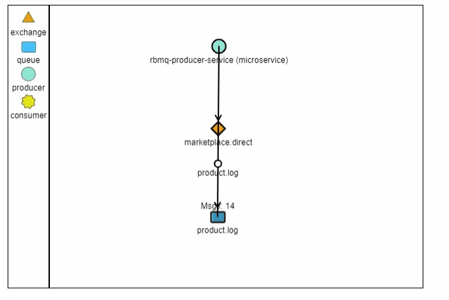

# Demo project for Spring Boot and RabbitMQ
Projeto de demonstração com a utilização de Springboot e RabbitMQ, para fins didaticos.


## RabbitMQ Simulator


## Documentação da API Producer

#### Adiciona uma mensagem na fila RabbitMQ

```http
  GET /api/produces?message={mensagem}
```

| Parâmetro  | Tipo       | Descrição                          |
|:-----------| :--------- | :--------------------------------- |
| `mensagem` | `string` | **Obrigatório** |


### Documentacao Referencia

* [Official Apache Maven documentation](https://maven.apache.org/guides/index.html)
* [Spring Boot Maven Plugin Reference Guide](https://docs.spring.io/spring-boot/docs/2.7.5/maven-plugin/reference/html/)
* [Create an OCI image](https://docs.spring.io/spring-boot/docs/2.7.5/maven-plugin/reference/html/#build-image)
* [Spring Web](https://docs.spring.io/spring-boot/docs/2.7.5/reference/htmlsingle/#web)
* [Spring for RabbitMQ](https://docs.spring.io/spring-boot/docs/2.7.5/reference/htmlsingle/#messaging.amqp)

### Guias

* [Building a RESTful Web Service](https://spring.io/guides/gs/rest-service/)
* [Serving Web Content with Spring MVC](https://spring.io/guides/gs/serving-web-content/)
* [Building REST services with Spring](https://spring.io/guides/tutorials/rest/)
* [Messaging with RabbitMQ](https://spring.io/guides/gs/messaging-rabbitmq/)

